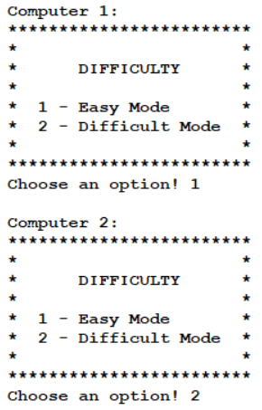
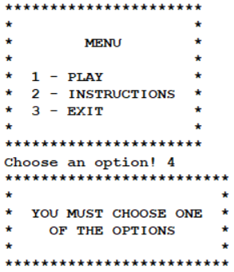

# **FEUP PFL Project 2 - UglyDuck**

**Group:** (UglyDuck_5)

**Game:** UglyDuck

| Student Number | Name                          | Contribution |
| :------------- | :---------------------------- | :----------- |
| up201905916    | André Correia da Costa        |      50%     |
| up201800177    | Marcos William Ferreira Pinto |      50%     |

**Class:** T1

## **Execution and installation**

To play this game it is necessary to have prolog installed (tested with SICStus Prolog 4.7.1). It is not necessary to install or configure anything else to execute the game. You just need to consult the <b><i>game.pl</i></b> file and type <b><i>play.</i></b> to start the game.

However, for a better experience while playing, the font can be set to `Courier New` with `Bold` and size `11`. This makes sure that different symbols present at the game are correctly represented.

## **Game Description** 

UglyDuck is a tabletop game using a 5x5 grid. Each player starts with 5 ducks, and the game starts with each player having a row of the board in opposite sides.
<br>
The objective is to advance to the end of the board and back. There is a twist that a duck that gets to the end of the board becomes a swan.

## **Game Rules**

The game is between two players.
Each payer starts with 5 ducks and the main objective is to get to the other side of the board, when the duck evolves into a swan, and get back the swan to the starting row.


During a player's round, they have to choose one piece to move forward. It can move forward directly or diagonally.


OBS: remember that a duck moves in one direction and the swan into another.

It is also possible to eat pieces of the adversary if you move diagonally on top of their piece. So be careful not to have your piece eaten!

Here is how to eat opponent's piece:


But it is not possible to eat opponent's piece in the following way:


Like mentioned before, the goal is to travel to the other side of the board and back. Wins the player who first move a swam into his first row or the player who eats every piece of the adversary!

## **Game Logic**

The predicate of the game is **play/0**.

### **1. Internal representation of the game**

The state of the game is internally represented in a `GameBoard` and a `Turn` 

The `GameBoard` is a matrix corresponding to what is occupying the space, like so (a board in the start of a game):

```prolog
[[duck_green, duck_green, duck_green, duck_green, duck_green]
[empty, empty, empty, empty, empty]
[empty, empty, empty, empty, empty]
[empty, empty, empty, empty, empty]
[duck_blue, duck_blue, duck_blue, duck_blue, duck_blue]]
```

The spaces can be filled with possibles values {empty, duck_green, duck_blue, swan_green, swan_blue}, where `empty` represents an empty space or a piece of the game and the rest the pieces of each player.

For example in the following boards it is possible to see the different valid values:

>Board in the middle of a game:
>
>```prolog
>[[empty, duck_green, empty, duck_green, duck_green]
>[empty, duck_blue, empty, empty, empty]
>[empty, duck_green, empty, empty, empty]
>[empty, empty, empty, duck_blue, empty]
>[duck_blue, empty, swan_green, duck_blue, duck_blue]]
>```

>Board in the end of a game:
>
>```prolog
>[[empty, empty, empty, swan_green, empty]
>[empty, duck_blue, empty, empty, empty]
>[empty, duck_green, empty, swan_blue, empty]
>[empty, empty, empty, empty, empty]
>[empty, empty, empty, duck_blue, empty]]
>```

This can be shown by some examples created in `game.pl` and displayed by the function `display_board/2`.

Also, the matrix of the board is a list of lists that contains the same number of columns and rows. For the game the size of the board is 5x5.

The `Turn` is the player who is currently in a round, it can have two values {green,blue}. Each representing a different player.

`GameBoard` and `Turn` work together to control the flow of the game and are usually send together to functions in a list, in the following way:

```prolog
[GameBoard|Turn]
```

OBS: The functions to create a board are located in `board.pl`.

### **2. Visualization of game state**

The game start with the visualization of the game main menu, which display the game logo and the menu:


This is made calling th function `menu` from menu.pl, which prints the logo and the menu.

The main menu also give the options to chose different options:

> By choosing 3 the game will exit.

The game will call `display_exit` from menu.pl which displays a goodbye message then exits the game.

> By choosing 2 the game will open the instructions page:


Above is the instruction page where a player can learn how to play the game, this is called using `display_instruction` from menu.pl .

> By choosing 1 the game will open the following menu:


Above is the menu where the player can choose the different game modes available. 
If the player chooses "Human vs Human" than the game starts without asking for more settings.
If the player chooses "Human vs Computer" than the player can choose the computer's difficulty and who starts the game.
If the player chooses "Computer vs Computer" it can choose separately the computers' difficulty (individually).



Also, it is important to mention, that in every input the player's input is verified and an error message is shown if needed, below is an example of this.



After all necessary choices the game start by displaying the board and asking for the movement of the starting player:


Above is the representation of the board. The board also prints the columns and row' *name* to show the player how to movement a piece.


Above is the message printed to ask for a player movement. It works in 2 phases, the first is to ask the player for the position of the piece they want to move.
The second step is to select the position to move the piece.

The image above also shows how errors are printed, it prints "Cell invalid!" and asked the player again for their input, until a valid input is given.

The game also has to represent the different pieces:


Above is the representation of the different pieces in the game:
- A1 represents the swan of the green player.
- A2 represents the duck of the green player.
- E1 represents the swan of the blue player.
- E2 represents the duck of the blue player.

The game also follows a cycle, so after the movement of a player it print the board and a message to signify the next player to play:


As it is possible to see in image above after the print it asks for the player movement.

This cycle continues until the end of the game where it displays one of the following message:
1. `Winner is Player x!` (where x is the player that won the game)
2. `YOU WON THE GAME!`
3. `YOU LOST AGAINST COMPUTER!`

Below is an example for the game end message:


The function used to display the game are in the file `view.pl`.

### **3. Moves during Execution**

A move is defined by an initial cell and a final cell, where each cell is defined by a Row and a Column. The initial cell must correspond to a place where there is a piece of the current player, the final cell should correspond to the destination of the piece.

A player in their turn chooses the movement using a system where {a,b,c,d,e} represents the rows and {1,2,3,4,5} represents the columns in the board. To get the move the function `get_move` is used.

The movement is translated using two functions `convert_to_row` and `convert_to_column` which divides the players' input and converts it to a coordinate that can be used by the game.

In the end of a move It verify if the piece needs to change from duck to swan and also updates the turn to the other players and. This uses the functions `duck_to_swan` and `update_turn`.

The function mentioned above and auxiliary functions are located in moves.pl .

### **4. Validation of Valid Move**

Additionally to the movement it is also necessary to verify if they are valid. The game does verifications to assert this condition.

The first verification done is in the translation of the player's input to the valid coordinates in the game. This is done inside `convert_to_row` and `convert_to_column` functions, if the input is not in the valid format or outside the valid rows {a,b,c,d,e} and columns {1,2,3,4,5} it fails to proceed with the movement and asks the player for their input again.
This verification is done in both the initial and final cells.

The second verification is to verify if the initial cell is indeed a piece of the current, for this the game uses the function `check_valid_piece`.

Even though there is the verification in the conversion functions there are also `check_valid_position` that also checks if the coordinates are inbounds of the game board, and verify if the move is valid. For example a move must advance forward, if a player tries to move back it fails and asks for their input again.
Another verification is made using `check_for_colisions` (done inside `check_valid_position`) which verifying if a player is trying to move their piece on top of another, which is not a valid move.

The functions to validate a move are also located in moves.pl .

### **5. End Game**

The game ends once one of the conditions below is met:
- A swan reaches the starter row of the player that he belongs to.
- Player has capture all pieces of the opponent.

After each round if one of the player achieves the condition to the end of the game, instead of asking for a move the game ends and the winner is announced.

The verification of these conditions are fairly simples:
> During the beginning of a round we verify if exists pieces for each player, if it does not it is a game over.
> It also goes to the starting line for each player and check for the existence of a swan, in case one is found it is a game over.

For better performance the verification of the existence of pieces are done together.

As mentioned in the visualization of the game state, once a game is finished a message with the winner is printed, as well the banner of the exit of our program.


### **6. Board Evaluation**

The evaluation of the board is important to detect the different states of a game. `Inital state`, which is well defined in the example shown above and created in the function `create_board`. `GameOver state`, which checks those 2 conditions above mentioned. `Intermediate state`, which is the game_loop. The Intermediate state has 3 different main functions according to the possible modes (p_vs_p, bot_vs_p and bot_vs_bot).

These 3 evaluations of the board give satisfactory results for the requirements of the project and game functioning, although we know that this could be improved like mentioned in the *`Future Plans`*.

### **7. Computer's AI**

The computer AI has two different settings:

> Easy Mode
>
> This is a very simple "AI", it works by finding all valid movements for the current round and choosing from this list a random movement.

> Hard Mode
>
> In this setting, the game tries to be a little more smart about how to move the pieces. <br>
> As with the last setting it first finds the list of possible movements for the current round. However instead of randomly making a move it follows the following rules in order: <br>
> 1. If the AI can finish the game (move a swan to the starting line) it will choose this move;
> 2. If the AI can eat an opponents' piece (in case of more than one move in which this happens, it will choose at random);
> 3. In case it can turn a duck into a swan;
> 4. If there are swans with the ability to move, chooses randomly;
> 5. In case none of the conditions above happens it will choose a random movement;
> <br>
> These rules was derived by trying different approaches that ended up being very easy to predict. The first one was to create a score system that used distance to win, among others attributes. The problem was that it would move the piece closest to win, meaning it always moved the same piece. Other approaches had similar effects.

The movement of the bot is made with the function `choose_move` and auxiliary functions. <br>
These functions used in the bot can be found in bot.pl .

## **Conclusions**

This project was helpful to create a deeper understanding of prolog and different concepts regarding functional logic programming. Another essential factor was to organize the code in a way that made it efficient.

To conclude, this project helped us to solidify and better understand the concepts taught in classes in a hands down approach.

## **Future Plans**

Implementation of `Minimax` for computer difficulty where an user could choose different difficulties that would represent the deepness of the tree. this also implies a better scoring system for the AI movement.

Regarding the *`Board Evaluation topic`*, a `Pause` state feature could be implemented. It would show a banner presenting options like *`Resume`*, *`Instructions`* and *`Exit game`*.
